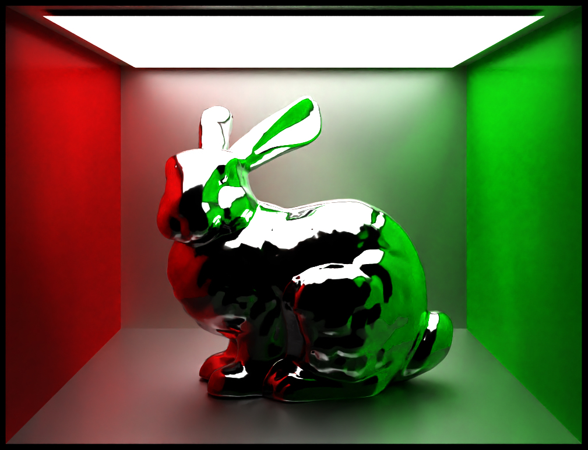

# Flashbang Renderer

Flashbang is a physically-based renderer built on the Lightwave framework. It was implemented over the course of the [CG1](https://graphics.cg.uni-saarland.de) computer graphics course.

<p align="center">

</p>

## Features

- Triangle meshes (ply) + rectangle and sphere primtives
- BVH acceleration with binning
- Multithreaded rendering
- Diffuse, Conductor, Dielectric, and Principled BSDFs
- Image and checkerboard textures
- Point, Directional, Area, and Image-based lighting
- Next Event Estimation or Pathtracing modes
- Halton sampling
- Image denoising
- Alpha masking
- Shading normals

Visit https://sami-hatna66.github.io/flashbang-showcase/ to see a complex scene rendered with Flashbang which showcases and provides details about many of these features.

## Usage

Most of Flashbang's dependencies come packaged in this repository. The only exception is [Intel Open Image Denoise](https://github.com/OpenImageDenoise/oidn), which must be installed separately (Flashbang can still be used without OIDN, but output images will be noticeably noisier). To compile the library:

```shell
mkdir build && cd build/
cmake -G Ninja -DCMAKE_BUILD_TYPE=Release ..
ninja
```

Scenes are encoded as xml files. The repo comes with a sample scene which you can render as follows:

```shell
./flashbang ../sample/sample.xml
```

You can render your own Blender scenes with Flashbang by installing the Lightwave exporter as a Blender add-on (blender_exporter/lightwave_blender.zip)